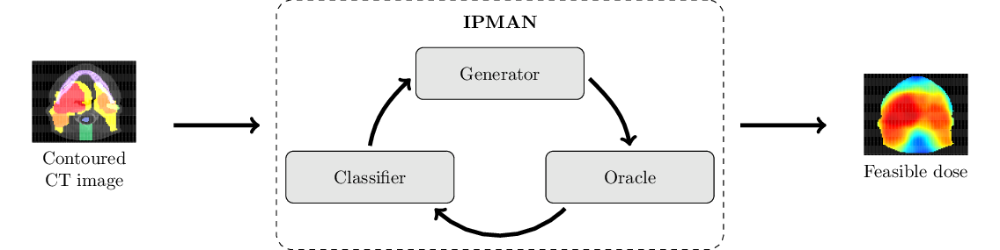

# Interior point methods with adversarial networks for radiation therapy
 
This repository trains a generator via our interior point method with adversarial networks (IPMAN) to generate dose distributions that satisfy fixed constraints and contextual constraints. The figure below is an overview of the training process.

  

## Citation
Please use our paper as the citation for this code repository:

A. Babier, T.C.Y. Chan, A. Diamant, R. Mahmood, "[Learning to optimize contextually constrained problems for real-time decision generation](https://arxiv.org/abs/1805.09293)", _Management Science_, 2023.

This repository recreates all the radiation therapy experiments from the paper using a public dataset called OpenKBP (acquired from [github.com/ababier/open-kbp](https://github.com/ababier/open-kbp)). As a result, the plots and results generated using this repository will be different from the results presented in the paper, which used a private clinical dataset. 

# Table of Contents
- [Data](#data)
- [Structure](#structure)
- [Prerequisites](#prerequisites)
- [Getting started](#getting-started)
- [Running the code](#running-the-code)
- [Experiment data structure](#experiment-data-structure)

## Data
This repository was written to for use with the OpenKBP dataset. More details about the dataset are available in [OpenKBP: The open-access knowledge-based planning grand challenge and dataset](https://aapm.onlinelibrary.wiley.com/doi/epdf/10.1002/mp.14845). In short, it contains data for 340 patients who were treated for head-and-neck cancer with intensity modulated radiation therapy. The data was split into training (*n*=200), validation (*n*=40), and testing (*n*=100) sets. Every patient in this dataset has a dose distribution, CT images, structure masks, a feasible dose mask (i.e., mask of where dose can be non-zero), and voxel dimensions. 

## Structure
Below, we summarize the functionality of each directory and script in _ipman-rt/_:

  - _algorithms/_ : execute the IPMAN training algorithms.
  - _analysis/_ : construct tables and plots from paper.
  - _networks/_ : construct, read, and write neural network models.
  - _open_kbp/_ : data loader for our public OpenKBP dataset.
  - _results_manager/_ : manage the paths where experiment results are saved.
  - _utils/_ : miscellaneous functions.
  - _main.py_: script to train and evaluate model performance.
  - _main_analysis.py_: script to generate table data and plots from paper.
  - _oracle.py_: label dose samples.
  - _setup.py_: script to set up data for experiments.

## Prerequisites
This repository was developed for systems with the following requirements, however, it should work with other hardware/software with some modifications.

- Linux
- Python 3.10.12
- NVIDIA GPU with CUDA and CuDNN (recommended)

## Getting started
 Below, we provide instructions for setting up this repository on a local machine. 

1. Make a virtual environment and activate it
    ```
    virtualenv -p python3.10 ipman-rt-venv
    source ipman-rt-venv/bin/activate
    ```
   
2. Clone this repository, navigate to its directory, and install the requirements. Note, that to run Tensorflow 2.14 efficiently on your machine, you may need to build Tensorflow 2.14 from source. The official instructions to build from source are available [here](https://www.tensorflow.org/install/source).
    ```
    git clone https://github.com/ababier/ipman-rt
    cd ipman-rt
    pip3 install -r requirements.txt
    ```

3. [Optional] Change the global variables `DATA_DIR` and `EXPERIMENTS_DIR` (see [experiment data structure](#experiment-data-structure)) in _utils/global_directories_ if you have somewhere specific you would like to store the corresponding data. By default, the directories are _ipman-rt/data_ and _ipman-rt/experiments_, respectively.

4. Run `setup.py` to download and clean the dataset. The setup script should download the data as a zip file and save it temporarily at _ipman-rt/open-kbp-data.zip_ before unzipping it, cleaning it, and saving it to the path represented by `DATA_DIR`. 
    ```
    python setup.py
    ```
   If the data fails to download a `ValueError` will be raised. If that happens, please download the data manually from our [OneDrive](https://1drv.ms/u/s!AuMp5xOixVAhhI4MWV8d-6-hH7CigA?e=sbhLLc), move it to _ipman-rt/_, and run `setup.py` again.

## Running the code
Running the code should be straightforward. Any errors are likely the result of data that is stored in an unexpected directory. If the code is running correctly, the progress of the neural network should print out to the commandline (local machine).

Run the main file in your newly created virtual environment with all or a subset of the parameters bellow (default values are provided in brackets): 

- `-experiment_id` (`"baseline"`): Used to label experiment models and results.
- `-num_iterations` (`11`): Number of iterations that IPMAN is trained for and/or evaluated over.
- `-l1_weight` (`50`): Weight assigned to the $l_1$ term in IPMAN loss function.
- `--use_alternative_criteria`: Flag to make oracle use alternative criteria.
- `--train`: Flag to train models with training data.
- `--validate`: Flag to evaluate models with validation data.
- `--test`: Flag to evaluate models with testing data.
- `--train_cnn`: flag to train CNN baseline model.

For example, the command below could be used to run experiment called `baseline` that trains IPMAN for 11 iterations, and evaluates the models on both the validation and test data.
```
python main.py -experiment_id baseline --train --validate --test 
```

The analysis from our paper can be completed by running the _main_analysis.py_ script. The `experiment_id` to analyze must be passed using the keyword `-experiment_id`. For example, the command bellow would run an analysis on the experiment with ID `baseline`:
```
python main_analysis.py  -experiment_id baseline 
```

Use `--help` (i.e., `python main_analysis.py --help`) to see a list of commands.

## Experiment data structure
During each experiment, data will is saved following every iteration and epoch (e.g., model weights, generated dose). The data is saved in the EXPERIMENTS_DIR (_experiments/_ by default) but can be changed in _utils/global_directories_.  The folder tree below can be used as a reference.
   
```
experiments
├── experiment_id
│   ├── analysis
│   │   ├── *.png
│   │   ├── *.csv
│   ├── classifier
│   │   ├── iteration_*
│   │   │   ├── epoch_*_model_weights.h5
│   │   │   ├── epoch_*_optimizer_weights.h5
│   ├── cnn_generator
│   │   ├── epoch_*_model_weights.h5
│   │   ├── epoch_*_optimizer_weights.h5
│   ├── discriminator
│   │   ├── epoch_*_model_weights.h5
│   │   ├── epoch_*_optimizer_weights.h5
│   ├── evauation
│   │   ├── gan_generator
│   │   │   └── iteration_None.csv   
│   │   ├── cnn_generator
│   │   │   └── iteration_None.csv   
│   │   └── ipman_generator
│   │       ├── lambda_*
│   │       │   ├── iteration_*.csv   
│   ├── gan
│   │   ├── epoch_*_optimizer_weights.h5
│   ├── gan_generator
│   │   ├── epoch_*_model_weights.h5
│   │   ├── epoch_*_optimizer_weights.h5
│   ├── images
│   │   ├── gan
│   │   │   ├── pt_*
│   │   │   │   ├── epoch_*.png
│   │   └── ipman
│   │       ├── lambda_*
│   │       │   ├── iteration_*   
│   │       │   │   ├── pt_*
│   │       │   │   │   ├── epoch_*.png
│   ├── ipman
│   │   ├── lambda_*
│   │   │   ├── iteration_*   
│   │   │   │   ├── epoch_*_optimizer_weights.h5
│   ├── ipman_generator
│   │   ├── lambda_*
│   │   │   ├── iteration_*   
│   │   │   │   ├── epoch_*_model_weights.h5
│   │   │   │   ├── epoch_*_optimizer_weights.h5
│   ├── loss
│   │   ├── classifier
│   │   │   ├── iteration_*   
│   │   │   │   ├── epoch_*.csv
│   │   ├── cnn_generator
│   │   │   ├── epoch*.csv   
│   │   ├── gan
│   │   │   ├── epoch*.csv   
│   │   └── ipman
│   │       ├── lambda_*
│   │       │   ├── iteration_*   
│   │       │   │   ├── epoch_*.csv
│   └── samples
│       ├── gan
│       │   ├── pt_*
│       │   │   ├── epoch_*.csv
│       └── ipman
│           ├── lambda_*
│           │   ├── iteration_*   
│           │   │   ├── pt_*
│           │   │   │   ├── epoch_*.csv

```
